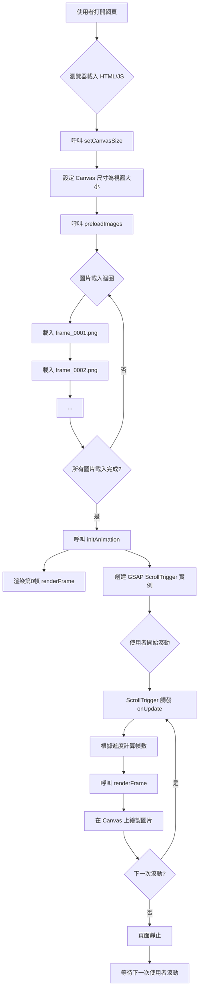

# 🎬 Scroll Trigger Frame Animation

一個使用 Canvas、Lenis 和 ScrollTrigger 實現的幀序列滾動動畫項目。

- Code: [https://github.com/chious/scroll-trigger](https://github.com/chious/scroll-trigger)
- Deployment: [https://chious.github.io/scroll-trigger/](https://chious.github.io/scroll-trigger/)

## 核心概念：將滾動進度映射到幀索引

ScrollTrigger 實現影片播放效果的關鍵在於**將滾動進度映射到幀索引**，具體流程如下：

### 0. 處理圖資

圖片資源來自於 [Davinci Resolve](https://www.blackmagicdesign.com/products/davinciresolve) 轉換後的 PNG frames，可以透過 [輪播圖片來源](https://www.pexels.com/video/a-desert-with-sand-dunes-and-some-bushes-19376556/) 來查看。

### 1. **準備工作**

```javascript
const frameCount = 251; // 總共 251 張圖片
const frameAnimation = { frame: 0 }; // 動畫對象，追蹤當前幀
```

### 2. **ScrollTrigger 設定**

```javascript
ScrollTrigger.create({
  trigger: ".hero",
  start: "top top",
  end: "+=300%", // 滾動 300% 的距離
  scrub: 0.8, // 與滾動同步
  pin: true, // 固定 hero 區域
  animation: gsap.to(frameAnimation, {
    frame: frameCount - 1, // 從 0 到 250
    ease: "none",
    duration: 1,
  }),
  onUpdate: function (self) {
    // 關鍵：將 frameAnimation.frame 轉換為幀索引
    const frameIndex = Math.round(frameAnimation.frame);
    renderFrame(frameIndex); // 渲染對應的幀
  },
});
```

### 3. **映射機制**

**滾動進度 → 幀索引的轉換：**

- **滾動 0%** → `frameAnimation.frame = 0` → 顯示第 1 幀
- **滾動 50%** → `frameAnimation.frame = 125` → 顯示第 126 幀
- **滾動 100%** → `frameAnimation.frame = 250` → 顯示第 251 幀

### 4. **為什麼這樣可以實現影片效果？**

1. **連續性**：`scrub: 0.8` 讓動畫與滾動完全同步，滾動一點點就更新一幀
2. **平滑性**：`Math.round()` 確保幀索引是整數，避免顯示不完整的圖片
3. **固定區域**：`pin: true` 讓 hero 區域在滾動時保持固定，用戶感覺在"播放影片"
4. **預載入**：所有 251 張圖片都預先載入，切換幀時沒有延遲

### 5. **視覺效果**

用戶滾動時：

- Hero 區域保持固定（pin）
- 背景的 Canvas 不斷切換顯示不同的幀
- 就像在播放一個 250 幀的影片（frame_0001.png 到 frame_0250.png）
- 滾動速度控制"播放速度"

---

## Q&A

### 1. 為什麼要使用 Lenis ?

- 原生的滾動行為：較為卡頓、不利於動畫效果

- Lenis：
  - 提供較平滑的滾動效果
  - 處理觸控設備

```javascript
const lenis = new Lenis({
  duration: 1.2,
  easing: (t) => Math.min(1, 1.001 - Math.pow(2, -10 * t)),
  smooth: true,
  mouseMultiplier: 1,
  smoothTouch: false,
  touchMultiplier: 2,
  infinite: false,
});

// GSAP 會根據 Lenis 實體來控制動畫效果
lenis.on("scroll", ScrollTrigger.update);

// 同步 GSAP 與 Lenis 的時間軸
gsap.ticker.add((time) => {
  lenis.raf(time * 1000);
});

// 由於使用 Lenis 控制 Scroll 效果，因此禁用 GSAP 原生的『延遲平滑』
gsap.ticker.lagSmoothing(0);
```

**註解 1**: 眾所皆知 Javascript 是單一執行緒的語言，如果使用 `setTimeout` 或 `setInterval` 來控制動畫效果，會導致整個單線程被卡住。`raf` 是 `requestAnimationFrame(callback)` 的縮寫，表示 **Request Animation Frame**。`requestAnimationFrame(callback)` 是瀏覽器提供的 API，並不會即時觸發 callback 函數，而是會在繪製下一個畫面重繪前呼叫 callback 函數，因此不會導致整個單線程被卡住。

因此使用 GSAP + Lenis 代表：

- GSAP 控制動畫效果
- Lenis 控制平滑滾動效果

同時同步兩者的時間軸，避免出現不同步的問題。

---

### 2. 為什麼要使用 Canvas ?

最直白想到抽換圖片的做法，是不斷抽換 `` 的 `src` 屬性來達到抽換圖片的動畫效果，但這會不斷更新 DOM 元素，頻繁的觸發瀏覽器的 Reflow 與 Repaint，導致效能下降（或是客戶端效能太差，可能會造成閃爍）。

而在 `<canvas>` 中，我們是在同一個 DOM 元素去呼叫 Canvas API（如：`context.drawImage()`、`context.clearRect()`）來達到抽換圖片的動畫效果，因此不會觸發瀏覽器的 Reflow 與 Repaint，但學習曲線相對較高。

**註解**: 什麼行為會觸發 Reflow & Repaint？

**Reflow**

- 改變 DOM 元素的尺寸、位置。
- 新增或移除 DOM 元素。
- 改變字體大小或文字內容。
- 改變瀏覽器視窗大小（例如調整視窗）。
- 啟動 CSS 動畫或變形（某些屬性）。
- 查詢某些 DOM 屬性，例如 offsetHeight、scrollWidth 等。

**Repaint** 則是指瀏覽器在渲染網頁時，重新繪製元素的視覺樣式，但不涉及佈局的改變。當一個元素的背景色、文字顏色、透明度、可見性等不影響其佔據空間的屬性發生改變時，就會觸發 Repaint。

---

然後再讓我們拉回來：ScrollTrigger 如何與 canvas 互動？

### 3. ScrollTrigger 如何與 canvas 的實作？

1. 初始化相關參數

```javascript
gsap.registerPlugin(ScrollTrigger);

const canvas = document.querySelector("canvas");
const context = canvas.getContext("2d");

const frameCount = 250;
const images = [];
let imagesLoaded = 0;
```

- `context` 是 Canvas API 的上下文，用於繪製圖片
- `frameCount` 是圖片的總數
- `images` 是圖片的陣列
- `imagesLoaded` 是已載入的圖片數量

2. 實作繪製動畫的函數：

```javascript
// 設定 Canvas 尺寸
function setCanvasSize() {
  canvas.width = window.innerWidth;
  canvas.height = window.innerHeight;
}
setCanvasSize();

// 預載入所有圖片
function preloadImages() {
  for (let i = 1; i <= frameCount; i++) {
    const img = new Image(); // 透過 Image 來預載入圖片，並儲存在記憶體。
    img.src = `./frames/frame_${i.toString().padStart(4, "0")}.png`;
    images.push(img);
    img.onload = () => {
      loadedCount++;
      if (loadedCount === frameCount) {
        console.log("所有圖片已載入");
        initAnimation();
      }
    };
  }
}

// 渲染指定的幀
function renderFrame(index) {
  const img = images[index];
  if (!img) return;

  context.clearRect(0, 0, canvas.width, canvas.height);
  context.drawImage(img, 0, 0, canvas.width, canvas.height);
}

// 初始化 ScrollTrigger 動畫
function initAnimation() {
  // 初始顯示第一幀
  renderFrame(0);

  // 創建一個簡單的物件來追蹤幀數
  const frameTracker = { frame: 0 };

  gsap.to(frameTracker, {
    frame: frameCount - 1, // 目標幀數
    ease: "none",
    scrollTrigger: {
      trigger: ".scroll-container",
      start: "top top",
      end: "bottom top",
      scrub: 1, // 將滾動進度與動畫同步
      onUpdate: (self) => {
        // 根據滾動進度更新幀數
        const frameIndex = Math.round(self.progress * (frameCount - 1));
        renderFrame(frameIndex);
      },
    },
  });
}

// 開始執行
preloadImages();
```

- `setCanvasSize()` 設定 Canvas 的尺寸
- `preloadImages()` 預載入所有圖片
- `renderFrame()` 渲染指定的幀
- `initAnimation()` 初始化 ScrollTrigger 動畫



### 3. ScrollTrigger 與輪播的關係？

> Q: GSAP 的 ScrollTrigger 初學者介紹的案例都是從 a 移動到 b ，為什麼會有輪播圖片的效果？

ScrollTrigger 之所以能產生輪播圖片的效果，是因為它把一個原本是空間變化 (position) 的概念，巧妙地轉化成了時間變化 (animation progress)。

關鍵在於 `scrub` 屬性。

當你設定 `scrub: true` 或一個數值時，ScrollTrigger 會做兩件事：

- 監聽滾動：它會持續追蹤你滾動頁面的距離。
- 轉換為進度：它將這個滾動距離轉換成一個從 0 到 1 的進度值。

這個進度值代表了動畫從開始到結束的百分比。

```javascript
gsap.to(frameAnimation, {
  frame: frameCount - 1, // 從 0 到 249 的變化過程
  ease: "none",
  scrollTrigger: {
    // ...
    scrub: 1,
    onUpdate: (self) => {
      const frameIndex = Math.round(self.progress * (frameCount - 1));
      renderFrame(frameIndex);
    },
  },
});
```

- 虛擬動畫：`gsap.to` 創建了一個虛擬動畫，它把 frame 這個數值從 0 平順地變到 249。

- 滾動同步：ScrollTrigger 的 `scrub` 屬性將這個虛擬動畫的進度，與你的滾動進度綁定。

- `onUpdate` 監聽：每當滾動發生，`onUpdate` 就會被呼叫，並給你當前的進度值 self.progress。
  - 當你滾動到動畫的 50% 處，self.progress 就是 0.5。
  - `0.5 * (250 - 1)` 約等於 124。

渲染圖片：`renderFrame(124)` 函式接著會將第 124 張圖片繪製到 `<canvas>` 上。

## TD;LR

- 由於時間的關係，沒有處理圖片最佳化、壓縮等。
- 避免生產環境透過 CDN 載入 Tailwind CSS。
- 手機版 RWD 尚未處理。
- 擴展性：建立多頁面來展示不同的 gsap 案例。

## 參考資料

1. [ScrollTrigger Hijacked My Video Playback (Now It Plays on Scroll)](https://www.youtube.com/watch?v=DTTNSjyEtes) -- 參考範例

2. [輪播圖片來源](https://www.pexels.com/video/a-desert-with-sand-dunes-and-some-bushes-19376556/) -- 輪播圖片來源

3. [Davinci Resolve](https://www.blackmagicdesign.com/products/davinciresolve) -- MP4 轉換為 PNG frames
